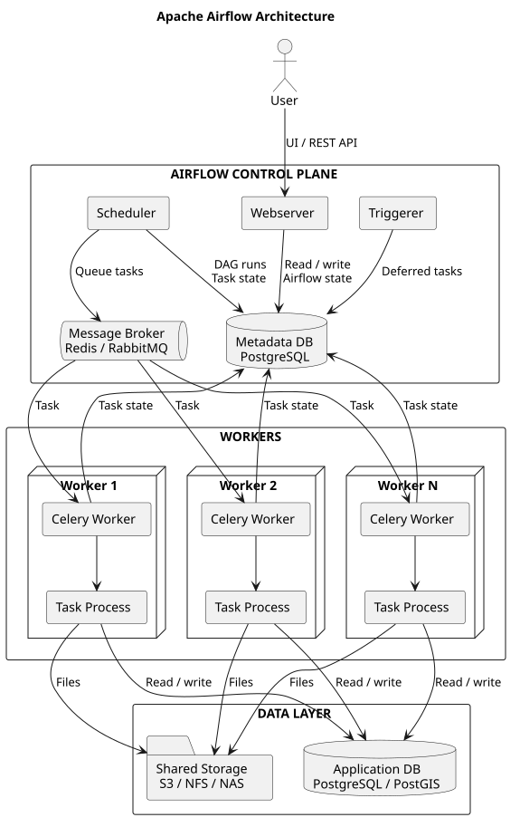

import EChart from '../../../components/EChart.astro';

## El problema

La monitorización manual de grandes extensiones costeras es lenta y difícil de reproducir. El objetivo de este proyecto de muestra es convertir una serie temporal de escenas Sentinel-2 en una cadena verificable: seleccionar observaciones comparables, separar agua y tierra y cuantificar el desplazamiento de la línea de costa.

## Enfoque

El flujo consulta escenas mediante STAC, aplica máscaras de nubes y normaliza cada observación antes de calcular índices espectrales. Una primera aproximación utiliza el índice normalizado de agua, donde $G$ es la banda verde y $NIR$ el infrarrojo cercano:

$$
\operatorname{NDWI} = \frac{G - NIR}{G + NIR}
$$

El umbral no se considera una constante universal. Se registra junto con la fecha, la cobertura nubosa y la versión del procesamiento para que cada geometría pueda reproducirse.

```python
import numpy as np

def ndwi(green: np.ndarray, nir: np.ndarray) -> np.ndarray:
    denominator = green + nir
    return np.divide(
        green - nir,
        denominator,
        out=np.zeros_like(green, dtype=float),
        where=denominator != 0,
    )
```

## Arquitectura

1. Consulta y selección de escenas con criterios espaciales y temporales.
2. Corrección, normalización y enmascarado de nubes.
3. Extracción de agua y validación de las geometrías resultantes.
4. Comparación temporal y publicación de productos trazables.

La implementación propuesta combina `Python`, `Rasterio`, `GeoPandas` y catálogos `STAC`. Las métricas de costa analizada, precisión y reducción de tiempo siguen siendo provisionales hasta ejecutar el estudio sobre un área validada.

## Arquitectura


## Ejemplo con ECharts

Este gráfico ilustrativo utiliza una tabla en `dataset.source` para mostrar la evolución relativa de tres clases costeras.

<EChart
  ariaLabel="Gráfico de áreas apiladas ilustrativo con la proporción anual de agua, arena húmeda y vegetación entre 2018 y 2025"
  option={{
    tooltip: { trigger: 'axis' },
    legend: { top: 0 },
    dataset: {
      source: [
        ['Fecha', 'Agua', 'Arena húmeda', 'Vegetación'],
        ['2018', 34, 40, 26],
        ['2019', 39, 36, 25],
        ['2020', 43, 32, 25],
        ['2021', 37, 35, 28],
        ['2022', 48, 29, 23],
        ['2023', 54, 24, 22],
        ['2024', 45, 31, 24],
        ['2025', 58, 22, 20]
      ]
    },
    grid: { left: '3%', right: '4%', top: '15%', bottom: '8%', containLabel: true },
    xAxis: {
      type: 'category',
      boundaryGap: false
    },
    yAxis: {
      type: 'value',
      max: 100,
      name: '%'
    },
    series: [
      {
        name: 'Agua',
        type: 'line',
        stack: 'total',
        areaStyle: {},
        emphasis: { focus: 'series' },
        encode: { x: 'Fecha', y: 'Agua' },
        itemStyle: { color: '#2f6f7e' }
      },
      {
        name: 'Arena húmeda',
        type: 'line',
        stack: 'total',
        areaStyle: {},
        emphasis: { focus: 'series' },
        encode: { x: 'Fecha', y: 'Arena húmeda' },
        itemStyle: { color: '#c75b39' }
      },
      {
        name: 'Vegetación',
        type: 'line',
        stack: 'total',
        areaStyle: {},
        emphasis: { focus: 'series' },
        encode: { x: 'Fecha', y: 'Vegetación' },
        itemStyle: { color: '#48664a' }
      }
    ]
  }}
/>
