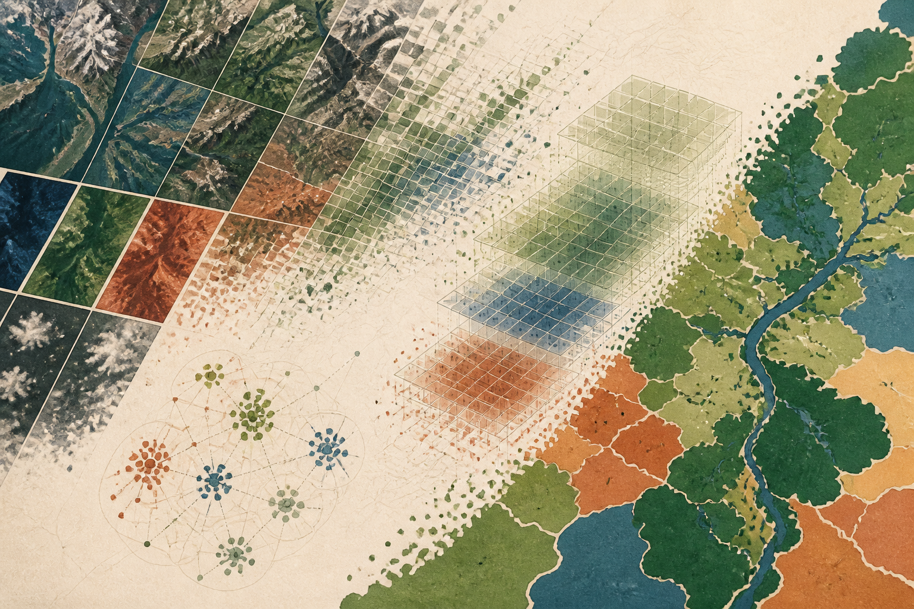

## El problema

Los modelos geoespaciales fallan cuando el muestreo, la división espacial y el seguimiento de experimentos no se diseñan como un único sistema. Una partición aleatoria puede situar píxeles vecinos en entrenamiento y validación, inflando las métricas sin mejorar la generalización territorial.

## Enfoque

El dataset se divide por bloques espaciales antes de extraer muestras. Cada ejecución conserva la versión de los datos, la configuración y los artefactos del modelo para que el resultado pueda compararse o reproducirse.



Para $C$ clases, el entrenamiento minimiza la entropía cruzada ponderada. Los pesos $w_c$ compensan el desequilibrio entre coberturas frecuentes y minoritarias:

$$
\mathcal{L} = -\sum_{c=1}^{C} w_c y_c \log(\hat{y}_c)
$$

```python
from sklearn.model_selection import GroupKFold

folds = GroupKFold(n_splits=5)
for train_idx, valid_idx in folds.split(features, labels, groups=spatial_blocks):
    train_model(features[train_idx], labels[train_idx])
    evaluate(features[valid_idx], labels[valid_idx])
```

## Arquitectura

1. Construcción y versionado del dataset espacial.
2. Entrenamiento y validación por bloques independientes.
3. Registro de parámetros, métricas y artefactos.
4. Inferencia por lotes con el mismo preprocesamiento.

La base tecnológica combina `PyTorch`, `scikit-learn`, `MLflow` y `DVC`. El F1 macro, el número de experimentos y la deriva se mantienen como métricas pendientes hasta sustituir los datos de muestra.
